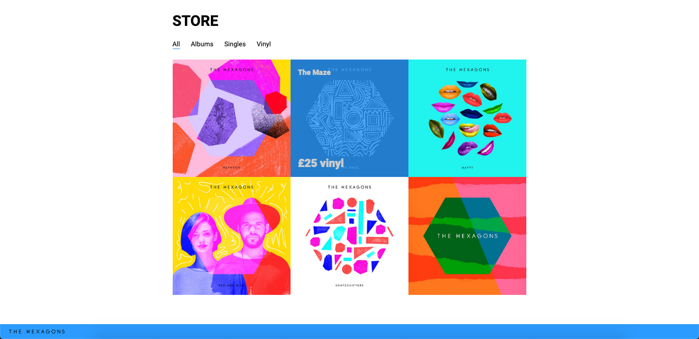

# Hexagon-fictional-band

This site is responsive and contains a sort of online shop design that I have built with HTML, CSS and some Java Script. 
This site is built with an outter container and inner container using different styles of layout with positioning and flexbox. 
We use Jquery in the store section menu and every time we hovers on the albums the price and title appears. 

Check this website [here](https://hexagon-homework5.superhi.com)

